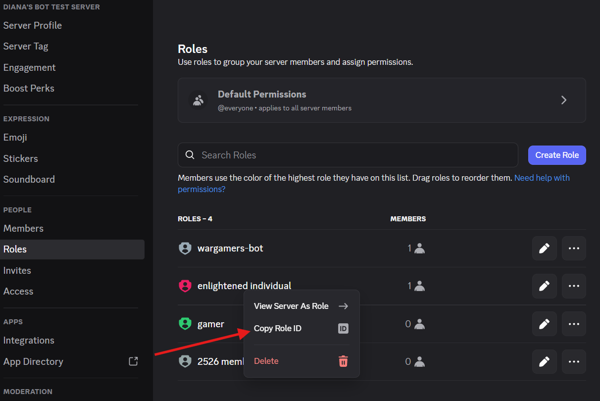
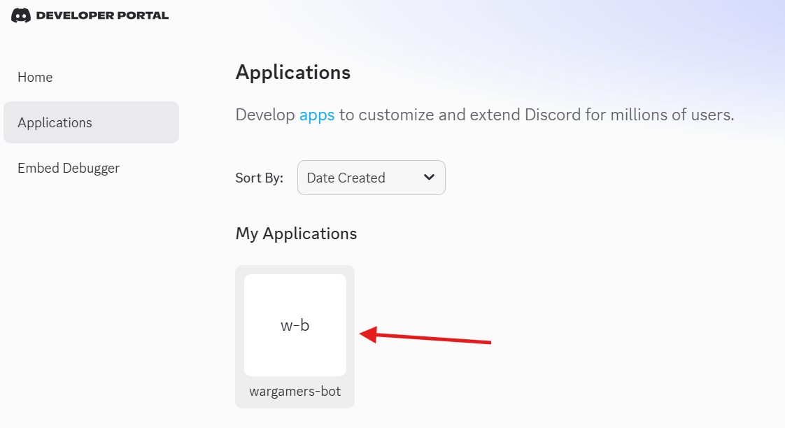
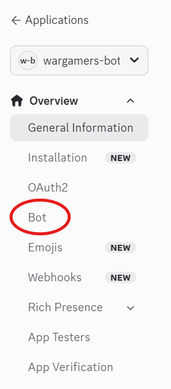
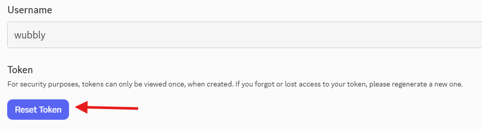
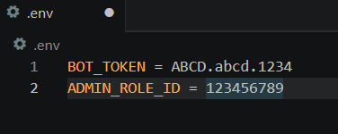
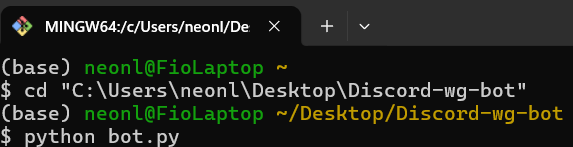
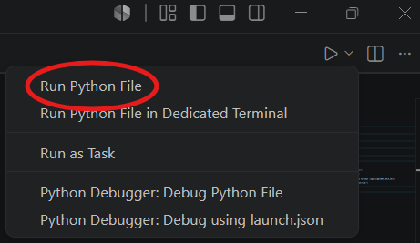

# Wubbly: The UBC Wargamers Bot
created by ex-president fiora!

This document is aimed at people who have minimal experience coding to prepare for the worst case scenario for future generations. If you do have coding experience, skimming the doc is still useful if you aren't familiar with `discord.py` or making bots in general, and if you are already an expert (something I most definitely am NOT) then you can read it anyways and laugh at all the places you would have done it better than I did

## How to use the bot
Assuming everything is working perfectly on the backend, using the bot is actually pretty easy! Simply preface whatever command you want to use with `%` followed by the name of the command. the command MUST be the first thing in the message, but the message can include any text after the command with no issue, most commands will just ignore it. The list of commands is as follows:
- `%check`
- - use restricted to: club execs
- - description: the bot will list various specifications it uses to perform other commands
- `%hello`
- - use restricted to: everyone
- - description: the bot will reply with a quick message, useful for making sure the bot is active and working properly
- `%update_members`
- - use restrcited to: club execs
- - description: will assign the specified role to all members of the server based on their username as given in the specified spreadsheet and specified column. the parameters can be specified using another command, this one will only ask you whether the specifications are correct before proceeding. The bot will also provide a list of any names that don't match server members
- `%update_bot`
- - use restrcited to: club execs
- - description: allows the user to change any bot specifications, including the role for update_members, the spreadsheet id and sheet name for the membership sheet to use, and the column name to take usernames from. The bot will dm the user to walk through the process

If the bot ever goes offline, all that needs to be done is to rerun the bot (see below). Once the bot goes back online it will send a message to its home channel and you're good to go!

## How to setup and change the bot
While using the bot is pretty easy, setting the bot up and changing it can be much more confusing if you don't have any coding experience. If you want to add more commands to the bot, or edit any existing ones, I can't help you too much in this medium so find someone you trust who can handle it. A much more likely case is that you will need to set the bot up again after a transfer of power, or edit any of the hardcoded variables due to security concerns or other reasons. First, you will need to download the `bot.py` and `wg_bot_specs.json` files to your computer, and you will need to create a `.env` file as well (yes that is the full file name, there shouldn't be anything before the .) This is most easily done through a code editor like vscode or similar. The bot uses 2 variables contained in the `.env` file that you will need to create in order to use the bot. For security reasons, the file and variable values have not been included here as to prevent anyone from being able to use and corrupt the bot without access to the club's discord account. You will NEVER be required to edit the json file yourself (the bot will do that) and you will only need to edit `bot.py` if you are planning to change/add commands.

### `ADMIN_ROLE_ID`
Some commands are restricted to use only by an admin role (eg club exec). To set this, type into the `.env` file `ADMIN_ROLE_ID = ...` replacing the ... with the id of the role you want to have access to these commands (most likely the club exec role, unless this bot lasts so long that the club hierarchy has changed unrecognizably). To get this id, you must have discord developer mode turned on and you can right click the role in the server settings  You can also update this value later by changing the value in the `.env` file.

### `BOT_TOKEN`
The bot token is the unique value attached to the bot that allows the code to connect to discord and actually have the bot do things. This value is vital to keep secret, since anybody who has your bot token can make their own code and effectively steal your bot, which is obviously REALLY bad. To find/create this token go to https://discord.com/developers/applications while signed in as the wargamers discord account. From there you should see "wargamers-bot" under "My Applications". Click on it to go to the dashboard for the app, and navigate to "bot" on the side panel. Scroll down to the "Token" section and you should see a button labelled "reset token". 
  

If you click this it will provide you a new token that you can then enter in the `.env` file as `BOT_TOKEN = ...`, replacing the ...

Once you reset the token the old one will immedaitely become invalid, so you will need to update it in the code regardless of if you meant to do so. You will also only have one chance to write down this token, and if you leave the page it will become hidden again. You do NOT need to do this step everytime the bot goes offline, only when you are moving the bot to a new host computer, or if you want to update the token for security reasons.

You can also update the name, image, header, and description of the bot here (for how its viewed in the server)

Here is an example of what your `.env` file should look like once you are done.

## How to run the bot
Once you have the bot setup correctly, all thats left to do is run it! You will need to have python installed on the host computer, as well as all the dependencies. You can look up how to do this online.

Now, simply run the code, either by clicking run in the code editor, or by running it from the terminal. To do this open a terminal window and navigate to the folder where your files are located using `cd path/to/your/folder` and then type `python bot.py`. Either way, the bot will continue running as long as the window where you ran it stays open. If this window closes because your computer shuts off, just simply rerun it once your computer begins running again.
 

If you have any questions or run into any trouble, good luck lmao. It shouldn't be too hard to find someone in the club to help you and the internet is also right there.

If you are better at this than I am, looking to take the bot to the next level, and are laughing at my bumbling instructions, then I also wish you good luck lmao, but this time I am laughing at myself.

